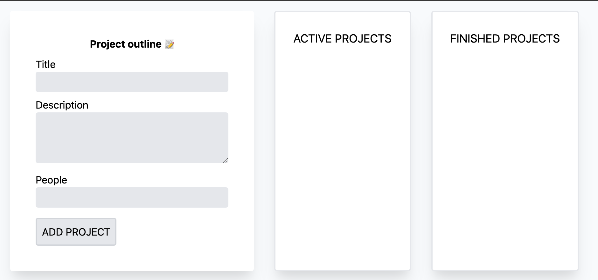

<br />
<p align="center">
  <a href="https://github.com/jschof1/AgileProjectOrganiser">
    
  </a>
  </a>

  <h1 align="center">Agile Project Organiser</h1>

  <p align="center">
    Drag and drop team tasks
    <br />
    <a href="https://github.com/jschof1/AgileProjectOrganiser"><strong>Explore the docs »</strong></a>
    <br />
    <br />
    <a href="https://blissful-golick-86d3dd.netlify.app">View Demo</a>
    ·
    <a href="https://github.com/jschof1/AgileProjectOrganiser/issues">Report Bug</a>
    ·
    <a href="https://github.com/jschof1/AgileProjectOrganiser/issues">Request Feature</a>
  </p>
</p>


<!-- TABLE OF CONTENTS -->
<details open="open">
  <summary><h2 style="display: inline-block">Table of Contents</h2></summary>
  <ol>
    <li>
      <a href="#about-the-project">About The Project</a>
      <ul>
        <li><a href="#built-with">Built With</a></li>
      </ul>
    </li>
    <li>
      <a href="#getting-started">Getting Started</a>
      <ul>
        <li><a href="#installation">Installation</a></li>
      </ul>
    </li>
    <li><a href="#license">License</a></li>
    <li><a href="#contact">Contact</a></li>
  </ol>
</details>


<!-- ABOUT THE PROJECT -->
## About The Project
<p align="center">
 <a href="https://transparentgovinfact.netlify.app/">
    
  </a>
  


Make a new task, set the team number, create the to-do card. When the task is finished drag and drop it into the complete box. Simples.


### Built With

* [HTML](https://developer.mozilla.org/en-US/docs/Web/HTML)
* [CSS](https://developer.mozilla.org/en-US/docs/Web/CSS)
* [TypeScript](https://www.typescriptlang.org/)


<!-- GETTING STARTED -->
## Getting Started

To get a local copy up and running follow these simple steps.

### Installation

1. Clone the repo
   ```sh
   git clone https://github.com/jschof1/AgileProjectOrganiser/
   ```
2. Install NPM packages
   ```sh
   npm install -g typescript
   npm run tsc
   ```


<!-- CONTRIBUTING -->
## Contributing

Contributions are what make the open source community such an amazing place to be learn, inspire, and create. Any contributions you make are **greatly appreciated**.

1. Fork the Project
2. Create your Feature Branch (`git checkout -b feature/AmazingFeature`)
3. Commit your Changes (`git commit -m 'Add some AmazingFeature'`)
4. Push to the Branch (`git push origin feature/AmazingFeature`)
5. Open a Pull Request


<!-- LICENSE -->
## License

Distributed under the MIT License. See `LICENSE` for more information.


<!-- CONTACT -->
## Contact

Jack Schofield - [@jack-schofield-developer](https://www.linkedin.com/in/jack-schofield-developer/) - jackschofield1@googlemail.com

Project Link: [Agile Project Organiser](https://github.com/jschof1/AgileProjectOrganiser)

